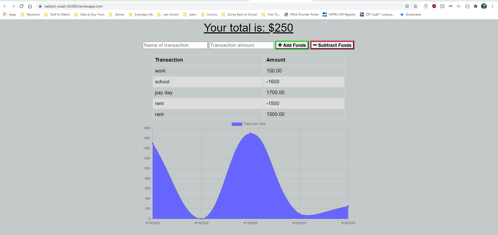

# Budget Tracker

## Description

A full stack budget tracking application that allows a user to add expenses and deposits to their budget with or without a connection. When entering transactions offline, the transaction total will populate when brought back online.

## Table of Contents

- [Demo](#demo)

# Demo

## License

MIT

## Contact

View the project at: https://aqueous-headland-09234.herokuapp.com/.
